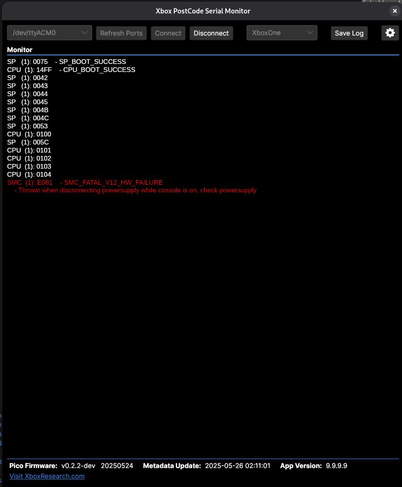

[](https://github.com/xboxoneresearch/XboxPostcodeMonitor/actions/workflows/build.yml)

[](https://github.com/xboxoneresearch/XboxPostcodeMonitor/releases/latest)

# Xbox PostCode Serial Monitor

A cross-platform (Linux, Windows, macOS) desktop GUI serial monitor built with Avalonia .NET.

To be used with [PicoDurangoPOST](https://github.com/xboxoneresearch/PicoDurangoPOST).

Error codes are synced from [errors.xboxresearch.com](https://errors.xboxresearch.com)

> [!IMPORTANT]
> You have to use at least fw v0.2.3 of `PicoDurangoPOST`

## Features

- Real-time serial output display
- Automatic metadata (post/error codes) update
- Saving log with raw & decoded output
- Less updating of Pico firmware -> Postcode changes are synced to the PC tool instead

## Usage

- Download latest build from [Releases page](https://github.com/xboxoneresearch/XboxPostcodeMonitor/releases)
- Start the application
- Select a serial port from the dropdown
- Click Connect to start monitoring

## Screenshots



## Development

### Requirements

- .NET 9 or newer SDK

### Build

```sh
# Run the app
dotnet run
```

## ToDO

- I2C Scanning (only if we can get it stable!)
- Notify user about new available app version
- Notify user about new available Pico firmware
